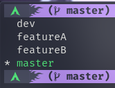
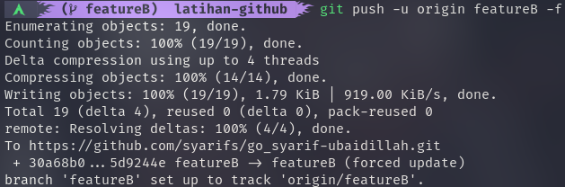
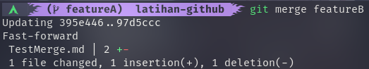
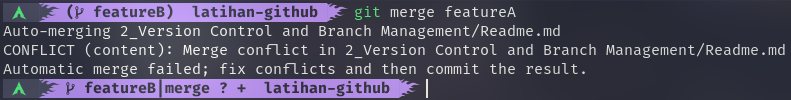
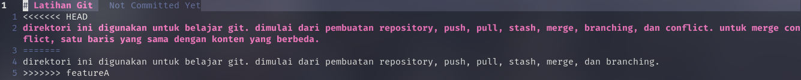
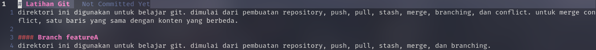
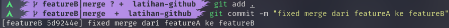

# Version Control and Branch Management
materi kedua berisi tentang penggunaan git dengan remote repository github. dimulai dari pembuatan repository, push, pull, stash, merge, branching, dan conflict.

## Hasil Praktikum

### Membuat 3 Branch

untuk membuat branch dapat menggunakan perintah `git branch <nama_branch>`. dan dalam kasus kali ini, terdapat 3 branch baru yang dibuat dengan nama `dev`, `featureA`, dan `featureB`.

### Push

untuk melakukan push dapat menggunakan perintah `git push origin`. tetapi untuk branch yang berbeda seperti gambar diatas, dapat menggunakan `git push -u origin featureB -f`. dimana `-u` digunakan untuk menentukan upstream dari remote server yang dituju, dan diikuti nama branch yang digunakan untuk melakukan push, dalam gambar diatas nama branch adalah `featureB`. lalu ada juga opsi `-f` yang digunakan untuk memaksa push ke remote server.

### Pull

pull disini digunakan untuk memperbarui data lokal kita dengan data yang tersimpan di remote server. perintah yang digunakan adalah `git pull`.

### Merge

untuk menggabungkan branch dapat dilakukan dengan merging dengan perintah `git merge <nama_branch>`, pastikan nama branch yang aktif berbeda dengan target penggabungan. pada gambar diatas, branch aktif adalah `featureA` dan target merge adalah branch `featureB`.

### Merge Conflict

saat melakukan penggabungan branch terkadang ada saja conflict yang terjadi. ini dikarenakan adanya perbedaan teks pada baris yang sama.

- Text

perbedaan teks dapat dilihat pada gambar diatas, dimana `<<<<< HEAD` adalah teks dari commit terakhir dari branch aktif. dan `>>>>>>> featureA` adalah branch yang akan digabung.

- Fix

untuk memperbaiki conflict, dapat dilakukan dengan menghapus atau mengubah baris yang menyebabkan conflict.

- Commit 

setelah dilakukan perbaikan pada baris yang terjadi conflict barulah dapat melakukan commit untuk menyelesaikan proses penggabungan.

### Merge no fast forward (--no-ff)

merge no fast forward digunakan untuk melakukan penggabungan dengan pesan commit yang masih dapat dimodifikasi.
