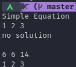
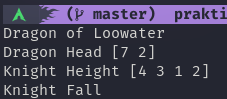
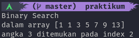

# Brute Force - Greedy and Divide and Conquer
dalam materi ini, kita akan mempelajari bagaimana melakukan bruteforce dan mengenal algoritma yang dapat digunakan untuk melakukan bruteforce.

## Hasil Praktikum

### Simple Equation [[Kode](./praktikum/simpleEquation/simpleEquation.go)]

### Money Coins [[Kode](./praktikum/moneyCoins/moneyCoins.go)]

### Dragon of Loowater [[Kode](./praktikum/dragonKnight/dragonKnight.go)]

### Binary Search [[Kode](./praktikum/binarySearch/binarySearch.go)]

