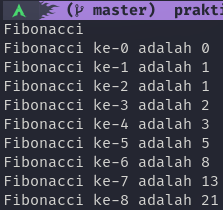
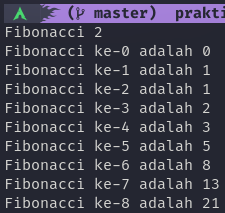
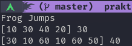

# Dynamic Programming
dalam materi ini, kita akan mempelajari bagaimana cara mengimplementasikan dynamic programming.

## Hasil Praktikum

### Fibonacci ([Kode](./praktikum/fibonacci/fibonacci.go))

### Fibonacci 2 ([Kode](./praktikum/fibonacci2/fibonacci2.go))

### Frog Jumps ([Kode](./praktikum/frog/frog.go))

