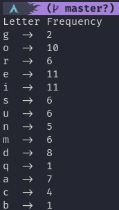

# Concurrent
dalam materi ini, kita akan mengenal apa itu concurrent programming dan mengimplementasikannya pada bahasa go.

## Hasil Praktikum

### Letter Frequency ([Kode](./praktikum/letterFreq/letterFreq.go))

