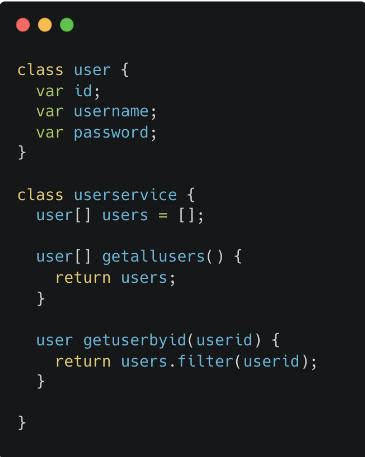
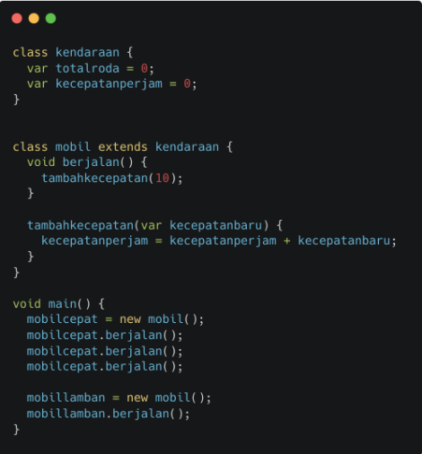

# Clean Code
dalam materi ini, kita akan mempelajari bagaimana mengimplementasikan clean code pada code yang akan ditulis.

## Hasil Praktikum
### Analysis

dari kode diatas, terdapat beberapa kesalahan. seperti penulisan nama *class*, sebaiknya menggunakan huruf kapital. karena jika menggunakan huruf kecil, bisa terjadi konflik antara nama *class* dan variabel. contoh `class User {}`. juga penulisan fungsi sebaiknya menggunakan huruf kecil jika hanya satu kata, jika terdapat dua kata atau lebih sebaiknya untuk memisahkan kata menggunakan huruf kapita. contoh fungsi satu kata `sum()`, contoh fungsi dua kata `getUser()`. untuk membuat list seharusnya menggunakan `List<type>`, contoh `List<User> users = []`. juga untuk fungsi `user[] getAllUser()` seharusnya `List<User> getAllUser()`, karena untuk mengembalikan atau membuat variabel dengan nilai list dalam dart menggunakan `List<Type>`.

### Rewrite ([Kode](./praktikum/rewrite/rewrite.go))
Kode asli menggunakan Dart, ditulis ulang menggunakan Go.

