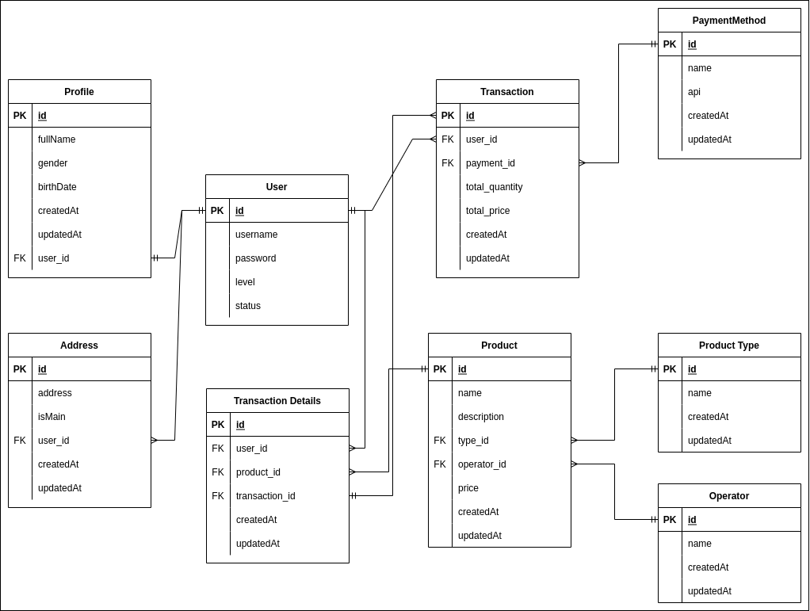

# Database - DDL - DML
dalam materi ini, kita akan mempelajari apa itu database, kegunaannya, dan syntax untuk menuliskannya.

## Hasil Praktikum
	
### Database Scheme

### SQL Alta Online Shop
- CREATE DATABASE ([Kode](./praktikum/alta_online_shop.sql?plain=1#L1))
- CREATE TABLE
	- User ([Kode](./praktikum/alta_online_shop.sql?plain=1#L5))
	- Product Type ([Kode](./praktikum/alta_online_shop.sql?plain=1#L51))
	- Operator ([Kode](./praktikum/alta_online_shop.sql?plain=1#L43))
	- Product ([Kode](./praktikum/alta_online_shop.sql?plain=1#L59))
	- Payment Method ([Kode](./praktikum/alta_online_shop.sql?plain=1#L77))
	- Transaction ([Kode](./praktikum/alta_online_shop.sql?plain=1#L87))
	- Transcation Details ([Kode](./praktikum/alta_online_shop.sql?plain=1#L103))
- CREATE TABLE kurir ([Kode](./praktikum/alta_online_shop.sql?plain=1#L123))
- ADD COLUMN ongkos_dasar TO kurir ([Kode](./praktikum/alta_online_shop.sql?plain=1#L133))
- RENAME TABLE kurir TO shipping ([Kode](./praktikum/alta_online_shop.sql?plain=1#L136))
- DROP TABLE shipping ([Kode](./praktikum/alta_online_shop.sql?plain=1#L139))
- One To One Relation ([Kode](./praktikum/alta_online_shop.sql?plain=1#L5-L28))
- One To Many Relation ([Kode](./praktikum/alta_online_shop.sql?plain=1#L16-L41))
