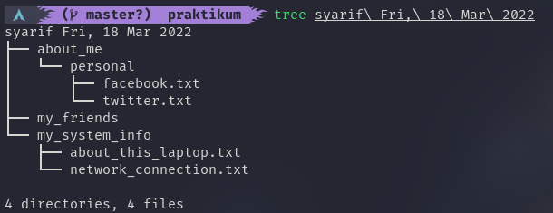

# Configuration Management and CLI
dalam materi ini, kita akan mempelajari bagaimana melakukan konfigurasi, manajemen dan menggunakan command line.

## Hasil Praktikum
### Install ZShell

### Automate Script ([kode](./praktikum/automate.sh))

	
