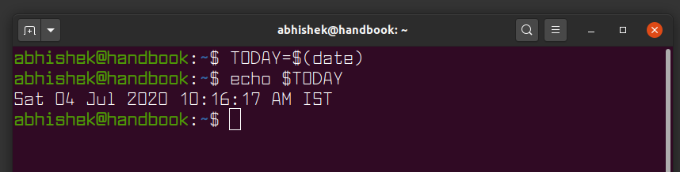

# Resume
Ringkasan untuk materi Configuration Management and CLI.
	
### Command Line
Sebuah *tools* yang sangat *powerful*, cepat, ringan, berbasis teks yang digunakan para *developer* untuk berkomunikasi dengan komputer lebih efektif dan efisien untuk menyelesaikan tugas.

#### Kenapa menggunakan Command Line ?
- kontrol akses pada suatu sistem atau aplikasi, berkas apa saja yang dapat diakses oleh user biasa atau root.
- kemampuan untuk menyimpan dan mengotomatisasi tugas sederhana.
- membantu mengatasi masalah pada sistem, seperti masalah jaringan.

#### Command Line Interface
| Shell | Other |
|-------|-------|
| Unix	| Python REPL |
| Command Prompt | MySQL Client (CLI) |
|		|	Mongo Shell |
|		| etc |

### Intro to Unix Shell
#### User Type in Unix Shell
| User | Description |
|------|-------------|
| Normal	|	User yang hanya dapat memanupulasi data pada direktori `/home/$USER` saja |
| Root	| User yang dapat memanipulasi keseluruhan data pada direktori `/` dan sistem |
| Sudoers	| Sebuah group yang memungkinkan anggotanya untuk menjadi `root` sementara |

#### Unix Shell
|	Name	| Picture	|
|-------|---------|
|	Bash	|  |
| ZSH		|		|

### Unix Shell Commands
#### Directory
|	Commands | Description | Examples	|
|----------|-------------|----------|
|	pwd	|	Digunakan untuk mengetahui *path* direktori aktif saat ini |	`pwd`	|
|	ls	|	Digunakan untuk menampilkan berkas yang ada didalam suatu direktori | `ls $HOME`	|
| mkdir	| Digunakan untuk membuat suatu direktori | `mkdir dir1`	|
| cd	|	Digunakan untuk mengganti direktori aktif	| `cd $HOME/.config`
| rm	| Digunakan untuk menghapus suatu berkas atau direktori	| `rm -rf ./dir1/` |
|	cp 	| Digunakan untuk menyalin berkas |	`cp $HOME/fileA $HOME/Documents/fileA` |
|	mv 	| Digunakan untuk memindahkan berkas |	`mv $HOME/fileA $HOME/Documents/fileA` |
| ln 	| Digunakan untuk membuat link atau shortcut dari suatu berkas atau direktori | `ln /srv/http $HOME/server` |

#### Files
|	Commands | Description | Examples	|
|----------|-------------|----------|
|	touch	| Digunakan untuk membuat berkas baru	|	`touch fileA`	|
|	chown	| Digunakan untuk mengganti kepemilikan dari suatu direktori atau berkas  | `chown $USER:$USER ./dirA/fileA`	|
| chmod	| Digunakan untuk memodifikasi *permission* dari suatu berkas	| `chmod +x fileA.sh`	|
| cat		| Digunakan untuk menampilkan isi dari suatu berkas teks	| `cat ./fileA` |

#### Utility
|	Commands | Description | Examples	|
|----------|-------------|----------|
|	which	| Digunakan untuk menemukan program yang terdaftar dalam *environment* `$PATH`	|	`which zsh`	|
|	grep	| Digunakan untuk menampilkan teks yang sesuai pada output suatu proses	|	`ps aux | grep zsh`	|
|	env		| Digunakan untuk menampilkan **environment variable** pada sistem	|	`env`	|
|	sudo	| Digunakan untuk menggunakan akses root dari user biasa, diharuskan terdaftar pada group `sudoers`	|	`sudo pacman -S mariadb`	|
