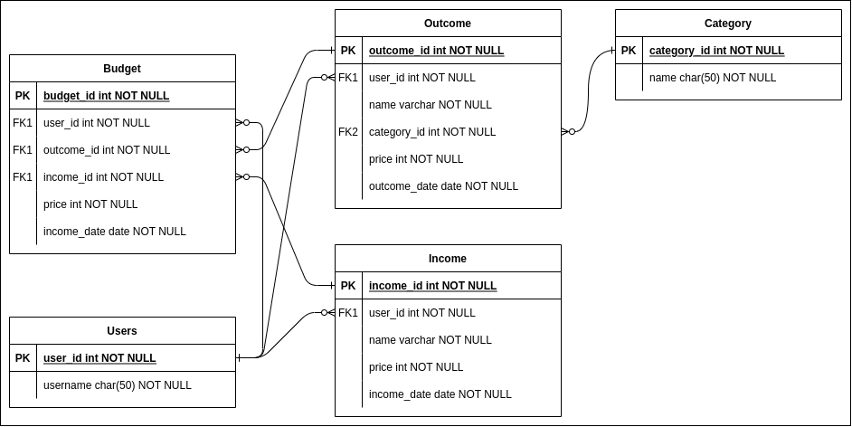

# System Design
dalam materi ini, kita akan mempelajari tentang bagaimana cara mendesain suatu sistem.

## Hasil Praktikum
### ERD Sistem Pengeluaran Harian


### Query
```sql
SELECT * FROM users;
```
> write code above to Redis, Neo4J, and Cassandra.

###### Redis
```
> HGETALL users
```

###### Neo4J
```
> MATCH (u:Users) RETURN u
```

###### Cassandra
```
> SELECT * FROM users;
```
	
