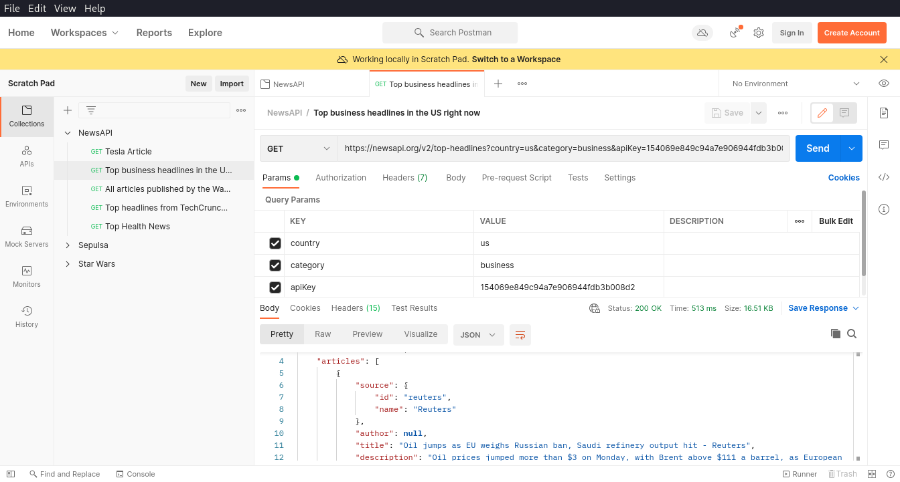
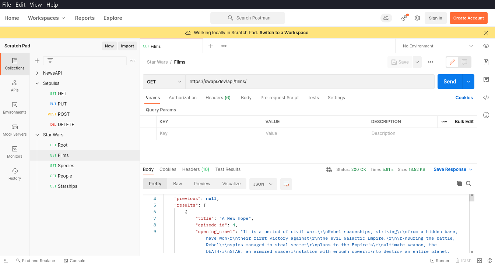
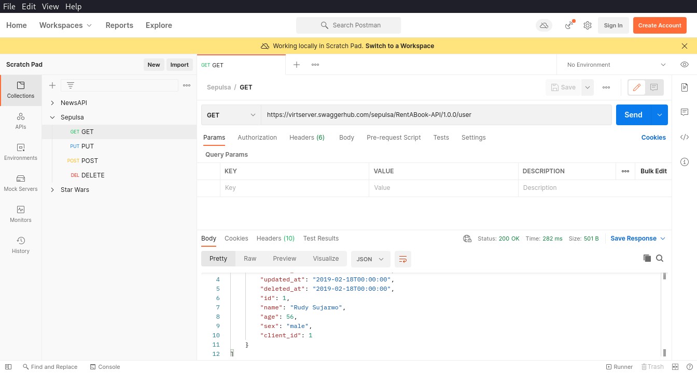

# Restful API
dalam materi ini, kita akan mempelajari restful api, apa itu restful api, bagaimana cara membuat dan menggunakannya.

## Hasil Praktikum
### NewsAPI ([kode](./praktikum/NewsAPI.postman_collection.json))

### Star Wars API ([kode](./praktikum/Star Wars.postman_collection.json))

### Sepulsa ([kode](./praktikum/Sepulsa.postman_collection.json))

