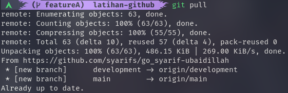
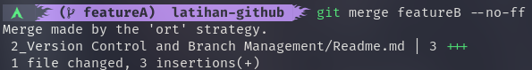

# Version Control and Branch Management
materi kedua berisi tentang penggunaan git dengan remote repository github. dimulai dari pembuatan repository, push, pull, stash, merge, branching, dan conflict.

## Hasil Praktikum

### Membuat 3 Branch

### Push

### Pull

### Merge

### Merge Conflict

- Text

- Fix

- Commit 

### Merge no fast forward (--no-ff)

