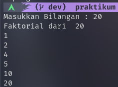
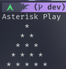

# Basic Programming
materi keempat adalah Basic Programming, dimana kita belajar tentang dasar pemrograman menggunakan bahasa go.

### Bilangan Prima

### Grade

### Luas Tabung

### Faktorial

### Palindrome

### Exponentiation

### Asterisk Play

### Tabel Perkalian

