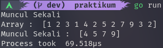

# Time Complexity and Space Complexity
materi kelima adalah Time Complexity and Space Complexity, dimana kita belajar tentang bagaimana memilih algoritma yang tepat untuk melakukan suatu proses dengan cepat dan efisien.

## Hasil Praktikum

### Bilangan Prima

### Exponentiation

### Array Merge

### Pair Sum

### Muncul Sekali

