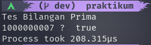
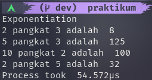
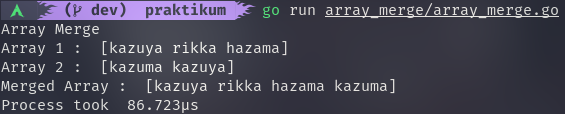
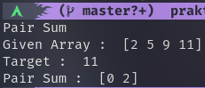
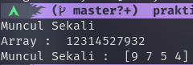

# Data Structure
materi keenam adalah Data Structure, dimana kita belajar tentang bagaimana memilih algoritma yang tepat untuk melakukan suatu proses dengan cepat dan efisien.

## Hasil Praktikum

### Bilangan Prima ([kode](./praktikum/prima/prima.go))

### Exponentiation ([kode](./praktikum/eksponen/eksponen.go))

### Array Merge ([kode](./praktikum/array_merge/array_merge.go))

### Pair Sum ([kode](./praktikum/pair_sum/pair_sum.go))

### Muncul Sekali ([kode](./praktikum/muncul_sekali/muncul_sekali.go))

