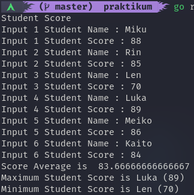
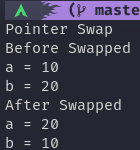

# String, Advance Function, Pointer, Method, Struct and Interface.
dalam materi ini kita akan mempelajari bagaimana cara mengolah string,pembuatan function yang baik, penggunaan pointer, method, struct, dan interface.

## Hasil Praktikum

### Caesar String ([Kode](./praktikum/caesar_string/caesar_string.go))

### Cipher ([Kode](./praktikum/cipher/cipher.go))
- Encode

- Decode

### Compare String ([Kode](./praktikum/compare_string/compare_string.go))

### Min Max ([Kode](./praktikum/minmax/minmax.go))

### Student Score ([Kode](./praktikum/student_score/student_score.go))

### Swap ([Kode](./praktikum/swap/swap.go))

