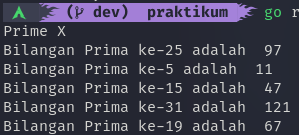
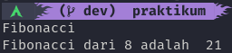
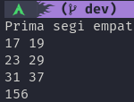
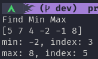
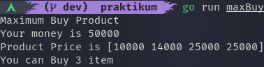
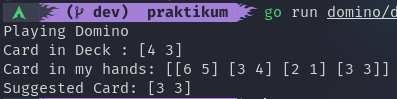

# Recursive, Number Theory, Sorting, and Searching
dalam materi ini, kita akan mempelajari bagaimana membuat fungsi rekursif, apa itu number theory, bagaimana menggunakan sorting, dan melakukan pencarian data.

## Hasil Praktikum

### Prima X ([Kode](./praktikum/primeX/primeX.go))

### Fibonacci ([Kode](./praktikum/fibonacci/fibonacci.go))

### Total Maksimum dari Deret Bilangan ([Kode](./praktikum/maxNumSeries/maxNumSeries.go))

### Prima Segi Empat ([Kode](./praktikum/rectPrime/rectPrime.go))

### Find Min Max Number ([Kode](./praktikum/findMinMax/findMinMax.go))

### Maximum Buy Product ([Kode](./praktikum/maxBuyProduct/maxBuyProduct.go))

### Playing Domino ([Kode](./praktikum/domino/domino.go))

### Most Appear Item ([Kode](./praktikum/mostAppear/mostAppear.go))

